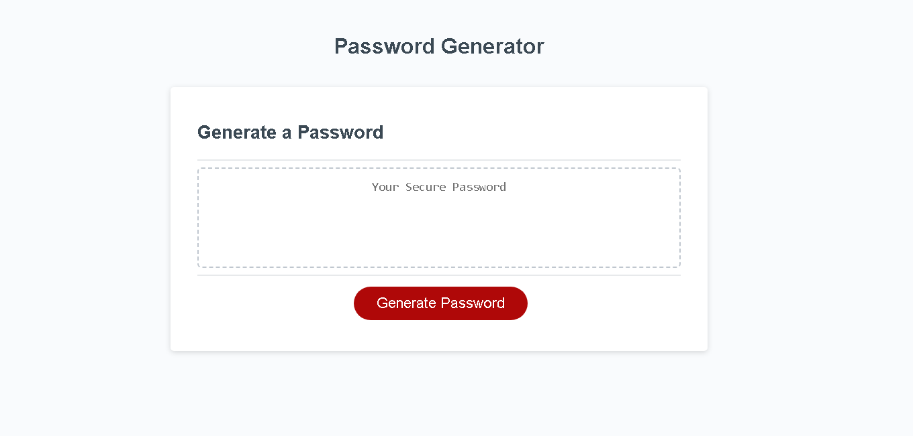

# Password Maker

## Description

This project challenge has the goal to create an application that generates a random password based on the criteria the user selects. This app will run in the browser, it involves basic HTML and CSS powered by the JavaScript code that I create for the application to meet the acceptance criteria. 
For the creation of the app I used diverse topics such as: console log, variables, primitive types, logical comparison operators, arrays, iteration, functions, scope and methods. 

With this app, the user has the possibility of chossing what character types he/she wants its password to include and the length of it, with this information, the app will return a secure and strong random password every time. 

## Installation

N/A

## Usage

When the user open the browser, then sees a "generate password" button. When the user clicks the button then a window prompt pops up asking for the length of the password, if the user choose a number between 8-128 then the series of confirmations begin, on the contrary, an alert is display saying that the number of characters allow are between 8-128. The series of confirmations are for the user to choose what character types want the password to include such as: Lowercase, Uppercase, Number and/or Special characters (User must choose at least 1 character type). 

After confirming and declaring the password length and all the criteria, the random password is display in the input box, meeting all the criteria the user choose. 

Link to github pages --> https://thelmarivas.github.io/passwordmaker/

## Credits

Use MDN documentation, bootcamp tutoring and Class content exercises.

## License

N/A

